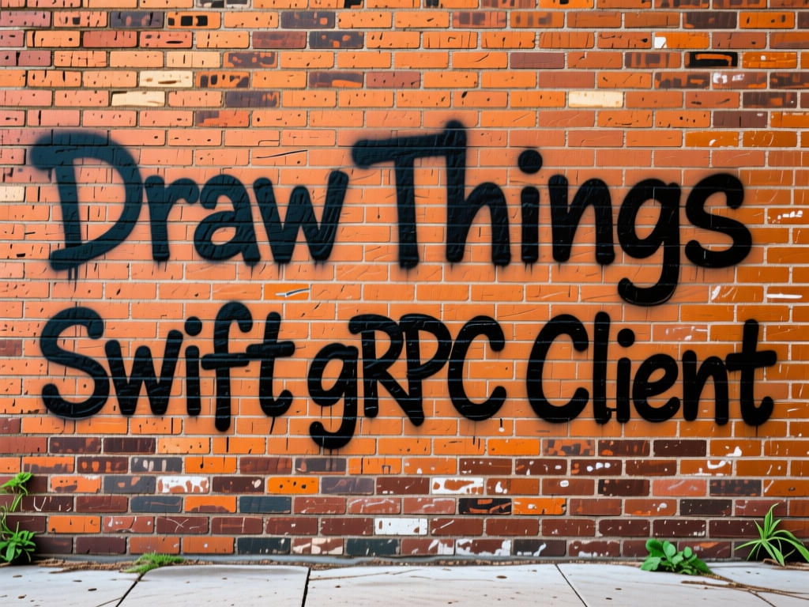

<p align="center">
  
</p>

# DrawThingsKit

A Swift framework for interacting with Draw Things gRPC server, designed for easy integration with SwiftUI applications on macOS.

## Features

- **Modern Swift Concurrency**: Built with async/await for clean, readable asynchronous code
- **SwiftUI Integration**: ObservableObject-based client with @Published properties for reactive UI updates
- **Progress Tracking**: Real-time progress updates during image generation
- **Image Utilities**: Built-in helpers for image conversion and manipulation
- **Type Safety**: Full Swift type safety with generated protobuf code

## Feature Status

### ✅ Tested & Working

The following features have been tested and confirmed working:

- **Text-to-Image Generation**: Basic image generation from text prompts
- **Image-to-Image**: Transform existing images based on prompts
- **Inpainting**: Selective image editing with masks
- **Moodboard/Reference Images**: Using reference images to influence generation (shuffle hints)
- **ControlNet Support**: Using ControlNet models for guided generation (e.g., PuLID, depth, pose, etc.)
- **LoRA Support**: Apply LoRA models to modify generation style
- **Video Generation**: Generate video/animation sequences (frames returned sequentially)
- **Image-to-Video**: Generate video from a starting image
- **Progress Tracking**: Real-time generation progress updates
- **Preview Images**: Receive preview images during generation
- **Model Metadata**: Query available models and samplers

### ⚠️ Untested Features

The following features are available in the protocol but have not yet been tested:

- **Multi-stage Models**: Stage 2 parameters for multi-stage generation pipelines
- **Advanced Optimization**: TEA Cache and other performance optimizations
- **File Upload**: Uploading models or other files to the server

Contributions and testing reports for these features are welcome!

## Requirements

- macOS 14.0+
- iOS 17.0+ (if building for iOS)
- Xcode 15.0+
- Swift 5.9+
- Draw Things app with gRPC server enabled or standalone gRPC server for nVidia

### Draw Things Server Setup

To use this framework, you need to configure the Draw Things gRPC server with the following settings:

1. **Response Compression**: Must be **disabled**
   - Having server-side compression enabled will cause failure, the framework does not currently have the ability to decompress responses

2. **Enable Model Browsing**: Recommended to be **enabled**
   - This allows the framework to query available models, samplers, and other metadata
   - Required for proper initialization and model selection

## Installation

### Swift Package Manager

Add DrawThingsKit to your project via Xcode:

1. File → Add Package Dependencies...
2. Enter the repository URL
3. Select the version/branch you want to use

Or add it to your `Package.swift`:

```swift
dependencies: [
    .package(url: "https://github.com/euphoriacyberware-ai/DT-gRPC-Swift-Client", from: "1.0.0")
]
```

## Quick Start

### Basic Usage

```swift
import DrawThingsKit
import SwiftUI

struct ContentView: View {
    @StateObject private var client: DrawThingsClient
    @State private var prompt = "A beautiful landscape"
    
    init() {
        do {
            let client = try DrawThingsClient(address: "localhost:7859")
            _client = StateObject(wrappedValue: client)
        } catch {
            fatalError("Failed to create client: \(error)")
        }
    }
    
    var body: some View {
        VStack {
            TextField("Enter prompt", text: $prompt)
            
            Button("Generate") {
                Task {
                    await generateImage()
                }
            }
            .disabled(!client.isConnected)
            
            if let progress = client.currentProgress {
                Text(progress.stage.description)
                ProgressView()
            }
        }
        .task {
            await client.connect()
        }
    }
    
    private func generateImage() async {
        do {
            let config = DrawThingsConfiguration(
                width: 512,
                height: 512,
                steps: 20
            )
            
            let images = try await client.generateImage(
                prompt: prompt,
                configuration: config
            )
            
            // Use generated images...
        } catch {
            print("Generation failed: \(error)")
        }
    }
}
```

### Configuration Options

```swift
let config = DrawThingsConfiguration(
    width: 1024,
    height: 1024,
    steps: 30,
    model: "sd_xl_base_1.0.safetensors",
    sampler: SamplerType.dpm2a.rawValue,
    cfgScale: 7.5,
    seed: 12345,
    clipSkip: 2
)
```

### Image-to-Image Generation

```swift
let inputImage = NSImage(named: "input.jpg")!

let images = try await client.generateImage(
    prompt: "Transform this into a watercolor painting",
    configuration: config,
    image: inputImage
)
```

### Inpainting with Mask

```swift
let inputImage = NSImage(named: "photo.jpg")!
let maskImage = NSImage(named: "mask.png")!

let images = try await client.generateImage(
    prompt: "A cat sitting in the masked area",
    configuration: config,
    image: inputImage,
    mask: maskImage
)
```

### Moodboard / Reference Images

Use moodboard (also known as "shuffle") to provide reference images that influence the generation. This is particularly useful with models like Qwen Image Edit:

```swift
// Single reference image
let referenceImage = NSImage(named: "style_reference.jpg")!
let referenceData = try ImageHelpers.nsImageToDTTensor(referenceImage, forceRGB: true)

var tensorAndWeight = TensorAndWeight()
tensorAndWeight.tensor = referenceData
tensorAndWeight.weight = 1.0  // Weight from 0.0 to 1.0

var hint = HintProto()
hint.hintType = "shuffle"  // Use "shuffle" for moodboard/reference images
hint.tensors = [tensorAndWeight]

let images = try await service.generateImage(
    prompt: "A woman wearing a blue dress",
    negativePrompt: "",
    configuration: configData,
    hints: [hint]
)
```

Multiple reference images can be provided by adding more hints to the array:

```swift
// Multiple reference images
var hints: [HintProto] = []

let referenceImages = [
    NSImage(named: "dress_ref.jpg")!,
    NSImage(named: "style_ref.jpg")!,
    NSImage(named: "color_ref.jpg")!
]

for refImage in referenceImages {
    let imageData = try ImageHelpers.nsImageToDTTensor(refImage, forceRGB: true)

    var tensorAndWeight = TensorAndWeight()
    tensorAndWeight.tensor = imageData
    tensorAndWeight.weight = 1.0

    var hint = HintProto()
    hint.hintType = "shuffle"
    hint.tensors = [tensorAndWeight]

    hints.append(hint)
}

let images = try await service.generateImage(
    prompt: "Combine elements from the reference images",
    negativePrompt: "",
    configuration: configData,
    hints: hints
)
```

**Note:** The moodboard feature works best with models that are designed to use reference images.

### ControlNet

ControlNet allows you to guide image generation using control images (such as depth maps, poses, or reference faces). The control image is provided as a hint, and the ControlNet model configuration specifies how to use it:

```swift
// Create ControlNet configuration
let controlConfig = ControlConfig(
    file: "pulid_flux_v0.9.1.safetensors",  // ControlNet model file
    weight: 1.0,                             // Control strength (0.0 to 2.0)
    guidanceStart: 0.0,                      // When to start applying control (0.0 = beginning)
    guidanceEnd: 1.0,                        // When to stop applying control (1.0 = end)
    controlMode: "balanced"                  // "balanced", "prompt", or "control"
)

// Create configuration with ControlNet
let config = DrawThingsConfiguration(
    width: 1024,
    height: 1024,
    steps: 30,
    model: "flux1_chroma_v48.safetensors",
    controls: [controlConfig]
)

// Prepare the control image (e.g., a face for PuLID)
let controlImage = NSImage(named: "reference_face.jpg")!
let controlImageData = try ImageHelpers.nsImageToDTTensor(controlImage, forceRGB: true)

var tensorAndWeight = TensorAndWeight()
tensorAndWeight.tensor = controlImageData
tensorAndWeight.weight = 1.0

var hint = HintProto()
hint.hintType = "shuffle"  // Control images are sent as hints
hint.tensors = [tensorAndWeight]

// Generate with ControlNet
let images = try await service.generateImage(
    prompt: "A full-body portrait of a character",
    negativePrompt: "",
    configuration: try config.toFlatBufferData(),
    hints: [hint]
)
```

**ControlNet Parameters:**

- `file`: The ControlNet model filename (must be compatible with the base model)
- `weight`: Control strength - higher values give stronger control (default: 1.0, range: 0.0-2.0)
- `guidanceStart`: When to start applying control during generation (0.0 = first step)
- `guidanceEnd`: When to stop applying control (1.0 = last step)
- `controlMode`:
  - `"balanced"`: Equal weight between prompt and control
  - `"prompt"`: Favor the text prompt more
  - `"control"`: Favor the control image more

**Common ControlNet Types:**
- **PuLID**: Face/character consistency (use with portrait/face images)
- **Depth**: Control composition with depth maps
- **Canny**: Edge-based control
- **Pose**: Human pose control (OpenPose)
- **Scribble**: Sketch-based control

### Using LoRAs

LoRAs (Low-Rank Adaptations) allow you to modify the generation style or add specific concepts:

```swift
// Create LoRA configurations
let loraConfig1 = LoRAConfig(
    file: "style_lora.safetensors",
    weight: 0.8,
    mode: "all"  // "all", "base", or "refiner"
)

let loraConfig2 = LoRAConfig(
    file: "concept_lora.safetensors",
    weight: 1.0,
    mode: "all"
)

// Create configuration with LoRAs
let config = DrawThingsConfiguration(
    width: 1024,
    height: 1024,
    steps: 30,
    model: "sd_xl_base_1.0.safetensors",
    loras: [loraConfig1, loraConfig2]
)

let images = try await client.generateImage(
    prompt: "A beautiful landscape",
    configuration: config
)
```

**LoRA Parameters:**
- `file`: The LoRA model filename (must be compatible with base model version)
- `weight`: LoRA influence strength (typically 0.0-1.0, but can go higher)
- `mode`: When to apply the LoRA
  - `"all"`: Apply to all stages
  - `"base"`: Apply only during base model generation
  - `"refiner"`: Apply only during refiner stage

### Video Generation

DrawThingsKit supports video/animation generation with models that support temporal generation (e.g., Stable Video Diffusion, AnimateDiff, etc.). Video frames are generated on the server and returned sequentially as individual images.

#### Text-to-Video

```swift
// Configure video generation parameters
let config = DrawThingsConfiguration(
    width: 1024,
    height: 576,
    steps: 30,
    model: "svd_xt_1.1.safetensors",
    numFrames: 25                // Number of frames to generate
)

let frames = try await client.generateImage(
    prompt: "A cat walking through a garden",
    configuration: config
)

// frames is an array of NSImage, one for each frame
print("Generated \(frames.count) frames")

// Process frames (e.g., save to disk, create video file, etc.)
for (index, frame) in frames.enumerated() {
    // Save frame_001.png, frame_002.png, etc.
    saveFrame(frame, index: index)
}
```

#### Image-to-Video

Generate a video starting from a base image:

```swift
let startImage = NSImage(named: "start_frame.jpg")!

let config = DrawThingsConfiguration(
    width: 1024,
    height: 576,
    steps: 30,
    model: "svd_xt_1.1.safetensors",
    numFrames: 25,
    strength: 0.8               // How much to transform the input image
)

let frames = try await client.generateImage(
    prompt: "Animate this image",
    configuration: config,
    image: startImage
)

print("Generated \(frames.count) video frames from input image")
```

**Video Generation Parameters:**

- `numFrames`: Number of frames to generate (e.g., 14, 25, 81)
- `startFrameCfg`: CFG scale for the first frame guidance (default: 1.0)

**Important Notes:**

- **Sequential Frame Delivery**: The gRPC server generates all frames, then sends them back **one at a time** in sequence. The `generateImage()` method will return an array with all frames once complete.
- **Processing Time**: Video generation takes significantly longer than single images due to generating multiple frames.
- **Frame Count**: Higher frame counts result in longer videos but also longer generation times.
- **Memory Usage**: All frames are held in memory as NSImage objects. For long videos (100+ frames), consider processing and saving frames as they arrive.

**Example: Saving Video Frames**

```swift
let frames = try await client.generateImage(
    prompt: "A serene ocean sunset with gentle waves",
    configuration: config
)

// Save frames as sequential PNG files
for (index, frame) in frames.enumerated() {
    let filename = String(format: "frame_%03d.png", index + 1)
    let url = outputDirectory.appendingPathComponent(filename)

    if let tiffData = frame.tiffRepresentation,
       let bitmap = NSBitmapImageRep(data: tiffData),
       let pngData = bitmap.representation(using: .png, properties: [:]) {
        try pngData.write(to: url)
    }
}

print("Saved \(frames.count) frames to \(outputDirectory.path)")

// Use external tools to create video from frames:
// ffmpeg -framerate 8 -i frame_%03d.png -c:v libx264 -pix_fmt yuv420p output.mp4
```

## Architecture

DrawThingsKit is built on top of:

- **gRPC Swift 2**: Modern gRPC client with async/await support
- **SwiftProtobuf**: Type-safe protocol buffer implementation
- **SwiftNIO**: High-performance networking

The framework provides two main interfaces:

1. **DrawThingsService**: Low-level async actor for direct gRPC communication
2. **DrawThingsClient**: High-level ObservableObject for SwiftUI integration

## Development

### Building from Source

1. Clone the repository
2. Install dependencies:
   ```bash
   brew install protoc-gen-grpc-swift swift-protobuf
   ```
3. Generate protobuf code (if needed):
   ```bash
   ./generate_protos.sh
   ```
4. Build:
   ```bash
   swift build
   ```

### Running Tests

```bash
swift test
```

### Example App

The repository includes a complete SwiftUI example application:

```bash
cd Examples/SwiftUIExample
swift run
```

## API Reference

### DrawThingsClient (SwiftUI)

- `init(address: String, useTLS: Bool = true)`: Create a new client
- `connect() async`: Connect to the Draw Things server
- `generateImage(...)` async: Generate images with progress tracking
- `@Published var isConnected`: Connection status
- `@Published var currentProgress`: Current generation progress

### DrawThingsService (Low-level)

- `echo(name:) async throws -> EchoReply`: Server health check
- `generateImage(...) async throws -> [Data]`: Generate images
- `checkFilesExist(...) async throws -> FileExistenceResponse`: Check file existence

### Configuration

- `DrawThingsConfiguration`: Image generation parameters
- `SamplerType`: Available sampling methods
- `ImageHelpers`: Image conversion utilities

## Error Handling

```swift
do {
    let images = try await client.generateImage(prompt: "test")
} catch DrawThingsError.connectionFailed {
    // Handle connection issues
} catch DrawThingsError.generationFailed(let reason) {
    // Handle generation errors
} catch {
    // Handle other errors
}
```

## Logging & Debugging

DrawThingsKit uses Apple's unified logging system (`os.log`) for diagnostic output. By default, logging is disabled in production.

### Enable Logging

To enable logging for debugging:

```swift
import DrawThingsKit

// Enable debug logging
DrawThingsKitLogger.minimumLevel = .debug

// Or set a higher threshold
DrawThingsKitLogger.minimumLevel = .info  // Only info and above
```

### Log Levels

- `.debug` - Detailed diagnostic information (request/response data, sizes, etc.)
- `.info` - General informational messages
- `.notice` - Significant events
- `.error` - Error conditions
- `.fault` - Critical failures
- `.none` - Disable all logging (default)

### Viewing Logs

Logs can be viewed in:
- **Console.app** on macOS (filter by subsystem: `com.drawthings.kit`)
- **Xcode Debug Console** during development
- Terminal using: `log stream --predicate 'subsystem == "com.drawthings.kit"'`

### Disable Emoji

If you prefer plain log messages without emoji prefixes:

```swift
DrawThingsKitLogger.useEmoji = false
```

## Contributing

1. Fork the repository
2. Create a feature branch
3. Make your changes
4. Add tests
5. Submit a pull request

## License

MIT License - see LICENSE file for details.

## Credits

This Swift framework is a port of the original TypeScript implementation by KC Jerrell:
- **Original Project**: [dt-grpc-ts](https://github.com/kcjerrell/dt-grpc-ts)
- **Author**: KC Jerrell ([@kcjerrell](https://github.com/kcjerrell))

Special thanks to KC for pioneering the TypeScript gRPC client for Draw Things, which served as the foundation for this Swift implementation.

## Compatibility

This framework maintains API compatibility with the Draw Things gRPC server protocol.
